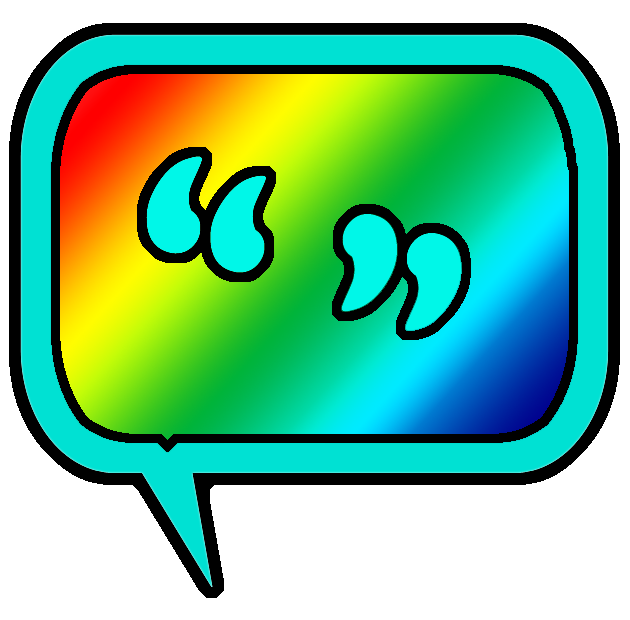

 
# LGBT-quotes Wordpress-plugin
A queer spin-off of the famous Hello Dolly plug-in that displays inspirational quotes for people of all Lesbian/ Gay/ Bisexual/ Transgender/ Queer rainbow diversities. When activated you will randomly see a quote displayed in a pink bubble at the upper right of your admin screen on every page.  

### Installation

Download this directory and save the ZIP file somewhere on your computer. In the admin dashboard of your self-hosted WordPress installation, the CMS can install the plugin for you. Use the '>> plugins >> add new' installer screen in your dashboard. After this, you will see a success message. Don't forget to activate the plugin.  
Or upload the unzipped file to the `/wp-content/plugins/rainbow-queery` folder of your self-hosted Wordpress installation. Again don't forget to activate the plugin.

### More?

New LGBTQIA quotes are always very welcome! Please submit them to me here: [@jirosworld](http://twitter.com/jirosworld) on Twitter.  
My big dream is to make all technology and all databases more diversity-friendly, one plugin at a time!  
~ JirosWorld - for all things queer in web development ~

### ☺
### License and Donation

Feel free to donate to me [through PayPal](https://www.paypal.me/jirosworld) here!  
Thank you to Matt Mullenweg for creating the Hello Dolly base code. Released under the terms of the GNU General Public License.

---
  
  
